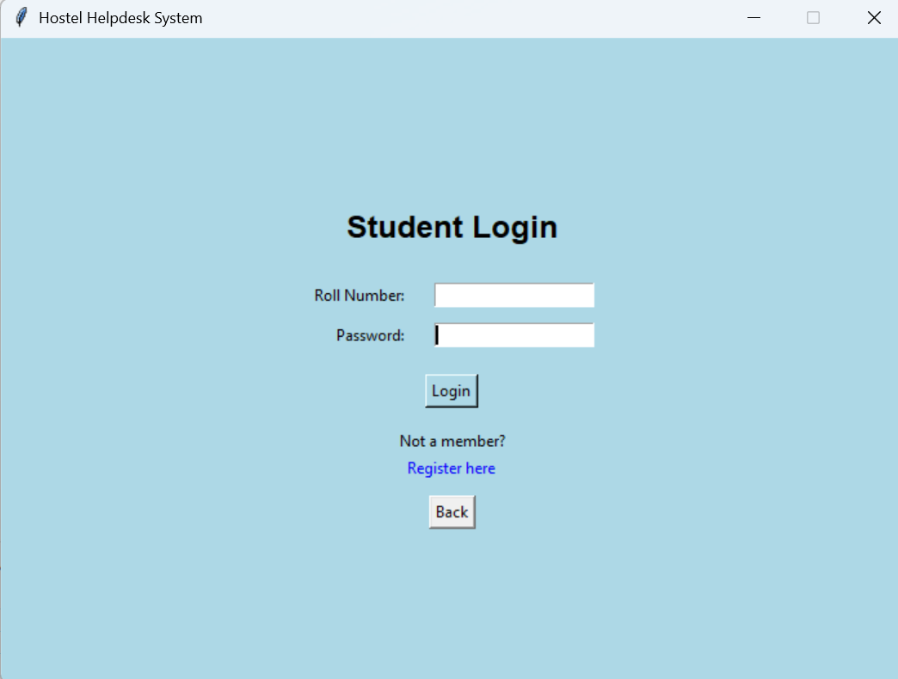
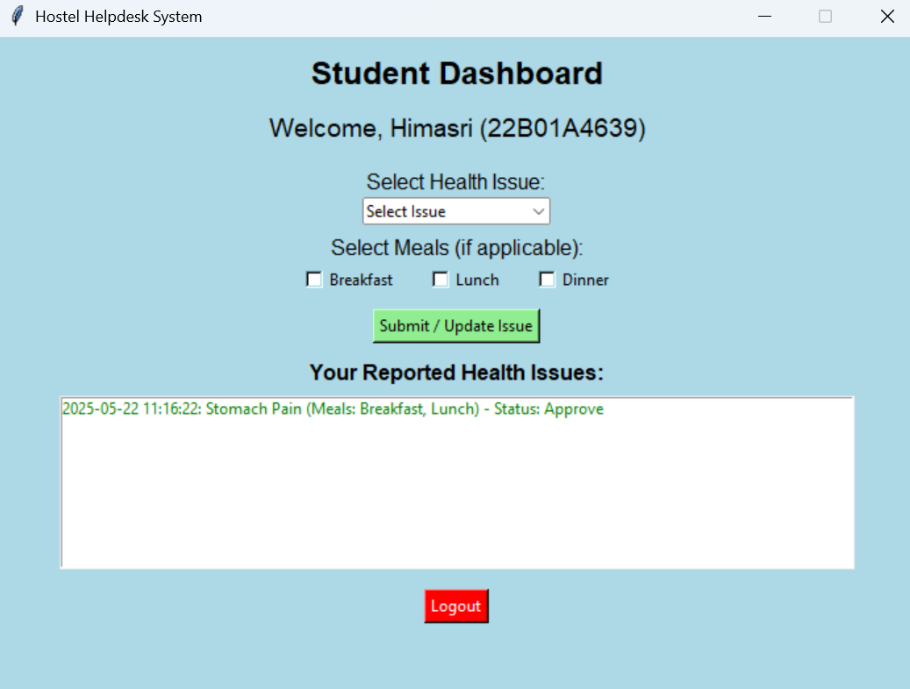
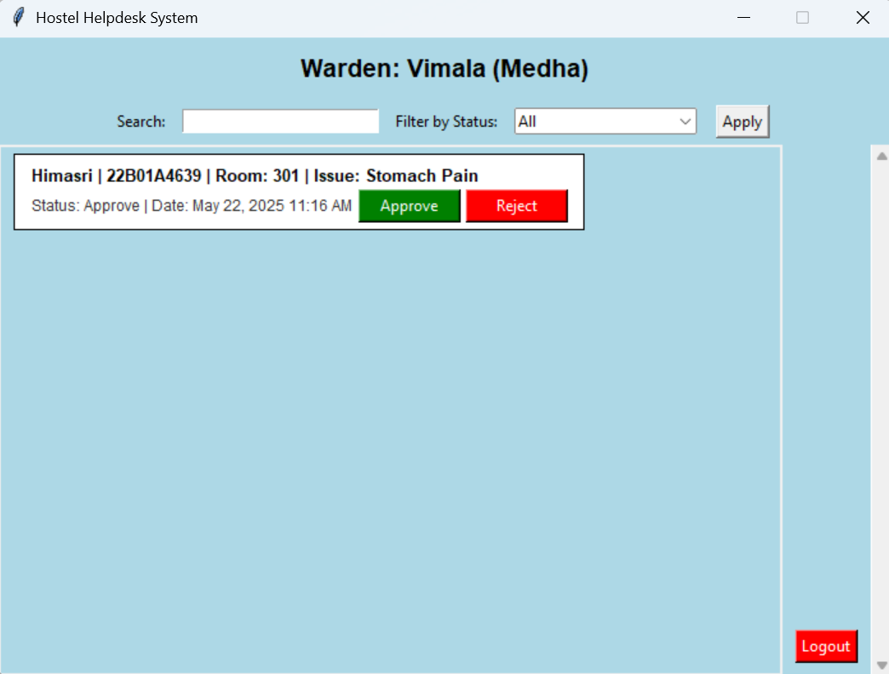

# 🥗 Food Swift

**Food Swift** is a desktop application designed to connect students and wardens in hostels. It helps hostelers request food delivery to their rooms when they're unwell, improving convenience and care.

---

## 💡 Features

- 🧑‍🎓 **Student Login and Registration**
  - New users can register in the application.
  - Existing users can securely log in to their dashboard.

- 📝 **Request Food When Sick**
  - Students can describe their health issue.
  - Select the number of meals, tiffin, or breakfast required for that day.
  - Requests are sent to the respective warden.

- 👩‍🏫 **Warden Portal**
  - Wardens receive all food requests.
  - Based on the student's condition, wardens approve or reject the request.
  - Status updates reflect on the student dashboard in real time.

---

## 🛠️ Tech Stack

- **Language**: Python
- **GUI Framework**: Tkinter
- **Database**: MySQL

---
### 🔐 Student Login


### 📝 Student Dashboard


### 📊 Warden Dashboard


---

## 🚀 Getting Started

### 1️⃣ Clone the Repository

```bash
git clone https://github.com/HimasriPenmetsa/Food___Swift.git
cd Food___Swift
